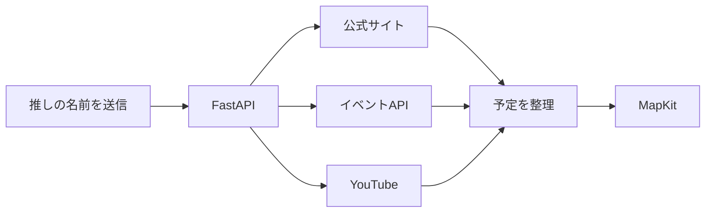

<p align="center">
  
</p>

<h1 align="center">♡Echo.me♡</h1>

<p align="center">
  <strong>推しの予定を、かわいく・かしこく・ひとつに。</strong><br>
  名前を入力するだけで、AIアシスタントが公開情報から今後の予定を探してくれるiOSアプリです。
</p>

<p align="center">
  
  
  
  
</p>

<p align="center">
  <sub>SwiftUI × FastAPI × Official Event Data</sub>
</p>

---

## 💗What is Echo.me?

Echo.meは、推し活のための予定管理アプリです。

チャットにアーティスト名を入力すると、Sony Music公式情報や対応済み公式サイト、設定したイベントAPIから確認可能な予定を検索。見つかったライブや配信予定を、開場・開演時間、会場、出典URLと一緒にカレンダーへ整理します。

|  |  |
| --- | --- |
| **Search** | チャットで推しの名前を送るだけ |
| **Collect** | 公式情報とイベントAPIから予定を検索 |
| **Calendar** | 確認できたイベントをカレンダーへ追加 |
| **Map** | MapKitで会場を検索してApple Mapsへ |

> [!NOTE]
> 現在の開発対象は`TestApp_New`です。`TestApp`はリメイク前の旧UIとして残しています。
>
> Echo.meのpr動画です。
> /Users/ui/Desktop/LifelsTech/TestApp_New/docs/assets/echome-demo.mp4


## 💗 Favorite Features

<table>
  <tr>
    <td width="50%" valign="top">
      <h3>🩷Floating Oshi Cloud</h3>
      推しの写真がふわっと浮かぶホーム画面。アイコンは指で移動でき、2本指で全体を拡大・縮小できます。
    </td>
    <td width="50%" valign="top">
      <h3>🩷Liquid Glass Cards</h3>
      ピンクや推し色が透ける、シンプルなガラス調カード。写真・名前・メモ・アクセントカラーを編集できます。
    </td>
  </tr>
  <tr>
    <td width="50%" valign="top">
      <h3>🩷 My Oshi Size</h3>
      アーティストごとにアイコンを「小・中・大」から選択。最推しを大きく表示できます。
    </td>
    <td width="50%" valign="top">
      <h3>🩷AI Assistant</h3>
      公開情報から今後のライブや配信を検索。会場・開場・開演時間・公式URLまでまとめます。
    </td>
  </tr>
</table>

### ほかにも

- 推しカードの追加・編集・削除
- 確認済みイベントのカレンダー登録
- AI由来の未確認候補を自動登録しない安全設計
- イベント詳細からiOS標準マップを起動
- チャット履歴を端末内の`UserDefaults`へ保存
- 重複イベントの抑制と検索結果キャッシュ

## 💗How It Works



| Layer | Technology |
| --- | --- |
| iOS App | SwiftUI / MapKit / PhotosUI |
| Backend | Python / FastAPI / Pydantic / HTTPX |
| Event Sources | Sony Music公式情報 / 公式サイト / Ticketmaster / Bandsintown / YouTube |
| Local Storage | UserDefaults / SQLite（利用量管理） |

## 💗Project Structure

```text
.
├── TestApp_New/               # 現行SwiftUIアプリ
├── TestApp_New.xcodeproj/     # 現行Xcodeプロジェクト
├── backend/                   # FastAPIバックエンド
│   ├── app/                   # API・検索プロバイダー・設定
│   ├── tests/                 # pytest
│   ├── .env.example           # 環境変数のひな型
│   └── README.md              # バックエンド詳細
├── docs/assets/               # README用ビジュアル
├── TestApp/                   # リメイク前の旧UI
└── TestApp.xcodeproj/         # 旧Xcodeプロジェクト
```

## 💗Quick Start

### Requirements

- macOS
- Xcode 26.2以降
- iOS 26.2 Simulator、またはiOS 26.2以降の実機
- Python 3.11以降

### 1 — Backend

```bash
cd backend
python3 -m venv .venv
source .venv/bin/activate
pip install -r requirements-dev.txt
cp .env.example .env
```

Sony Music公式情報と登録済み公式サイトのみ使う場合、APIキーは不要です。最初は`.env`を初期値のまま利用できます。

### 2 — Xcode

1. `TestApp_New.xcodeproj`を開く
2. Schemeで`TestApp_New`を選ぶ
3. iOS Simulatorを選んでRunする

共有SchemeのPre-actionが`backend/run_local.sh`を実行し、バックエンドを`127.0.0.1:8000`で自動起動します。

```bash
curl http://127.0.0.1:8000/health
```

```json
{"status":"ok"}
```

バックエンド起動中は[Swagger UI](http://127.0.0.1:8000/docs)も利用できます。

<details>
<summary><strong>Optional API Keys</strong></summary>

必要なサービスだけ`backend/.env`へ設定します。

```env
TICKETMASTER_API_KEY=
BANDSINTOWN_APP_ID=
YOUTUBE_API_KEY=
```

| Source | Key | Purpose |
| --- | --- | --- |
| Sony Music公式情報 | 不要 | 公式検索と公式ライブ情報 |
| 登録済み公式サイト | 不要 | 対応済みアーティストの公演情報 |
| Ticketmaster | 任意 | Ticketmaster掲載イベント |
| Bandsintown | 任意 | Bandsintown掲載イベント |
| YouTube Data API v3 | 任意 | 公式チャンネルの公開済み配信予定 |
| Gemini | 任意 | 名前抽出、確認必須のWeb検索候補 |

APIキーはSwiftコードや`Info.plist`へ書かず、必ず`backend/.env`へ保存してください。

</details>

<details>
<summary><strong>Running on a Real Device</strong></summary>

実機ではMacのLAN内IPアドレスを使用します。

1. `backend/.env`の`BACKEND_APP_TOKEN`へ32文字以上のランダム値を設定
2. Xcode SchemeのRun環境変数へ以下を追加
   - `CHATBOT_BASE_URL=http://MacのLAN内IP:8000`
   - `CHATBOT_APP_TOKEN=バックエンドと同じトークン`
3. バックエンドをLAN向けに起動

```bash
cd backend
source .venv/bin/activate
set -a
source .env
set +a
uvicorn app.main:app --reload --host 0.0.0.0
```

実機とMacは同じネットワークへ接続してください。

</details>

## 💗Free-first Setup

予期しない課金を避けたい場合の推奨設定です。

- Sony Music公式情報と登録済み公式サイトを中心に利用
- `GEMINI_ARTIST_EXTRACTION_ENABLED=false`
- `GEMINI_GROUNDED_SEARCH_ENABLED=false`
- Google Cloudへ課金アカウントを紐づけず、YouTube Data APIの無料クォータ内で利用
- 使用しないAPIキーは空欄にする

YouTube検索は24時間キャッシュされ、バックエンド1プロセスあたり1日80回までに制限されています。外部サービスの無料枠や利用規約は変更される可能性があるため、利用前に各管理画面も確認してください。

## 💗Tests

<details>
<summary><strong>Backend tests</strong></summary>

```bash
cd backend
source .venv/bin/activate
pytest
```

</details>

<details>
<summary><strong>iOS build</strong></summary>

```bash
xcodebuild \
  -project TestApp_New.xcodeproj \
  -scheme TestApp_New \
  -sdk iphonesimulator \
  -destination 'generic/platform=iOS Simulator' \
  CODE_SIGNING_ALLOWED=NO \
  build
```

</details>

## 💗Event Policy

- 公式情報やイベントAPIで日時を確認できた予定だけを登録します
- 同一イベントは取得元ID、日時、タイトルなどから重複を抑制します
- AI Web検索候補には`requires_confirmation=true`を付け、自動登録しません
- 公開情報に存在しない予定を推測して作成しません
- 検索結果が0件でも、公演が存在しないことを保証するものではありません

## 💗Troubleshooting

<details>
<summary><strong>Could not connect to the server.</strong></summary>

```bash
curl http://127.0.0.1:8000/health
cat "${TMPDIR:-/tmp}/echome-backend.log"
```

`backend/.venv`が存在することと、ポート`8000`を別のアプリが使用していないことを確認してください。

</details>

<details>
<summary><strong>イベントが0件になる</strong></summary>

- アーティスト名を公式表記で入力する
- 公式サイトに今後の予定が公開されているか確認する
- 外部APIのキーが`backend/.env`に設定されているか確認する
- 無料クォータやレート制限へ到達していないか確認する
- 時間を置いて再検索する

</details>

<details>
<summary><strong>.envがFinderに表示されない</strong></summary>

`.`から始まるファイルは隠しファイルです。Finderで`Command + Shift + .`を押すと表示を切り替えられます。

</details>

## 💗Security

- `backend/.env`、`.venv`、キャッシュ、SQLite利用量データはGit管理対象外です
- APIキーやアプリトークンをGitHubへPushしないでください
- APIキーが漏れた場合は直ちに無効化・再発行してください
- ループバック以外では`ALLOW_LOOPBACK_WITHOUT_TOKEN=false`を使用してください
- 公開サーバーではHTTPS、認証、監視、永続DBなどを別途設計してください

## 💗Current Limitations

- 公開されていないイベントは取得できません
- チケット情報の網羅性は取得元APIと公式掲載状況に依存します
- すべてのアーティスト・公演の取得を保証するものではありません
- Firebaseなどを使った端末間同期・ユーザー認証は未実装です
- 現在のバックエンドはローカル開発向けです

詳しい環境変数と検索仕様は[`backend/README.md`](backend/README.md)を参照してください。

---

<p align="center">
  <strong>Made with 💗 for every oshi moment.</strong><br>
  <sub>かわいい推し活を、もっと便利に。</sub>
</p>
